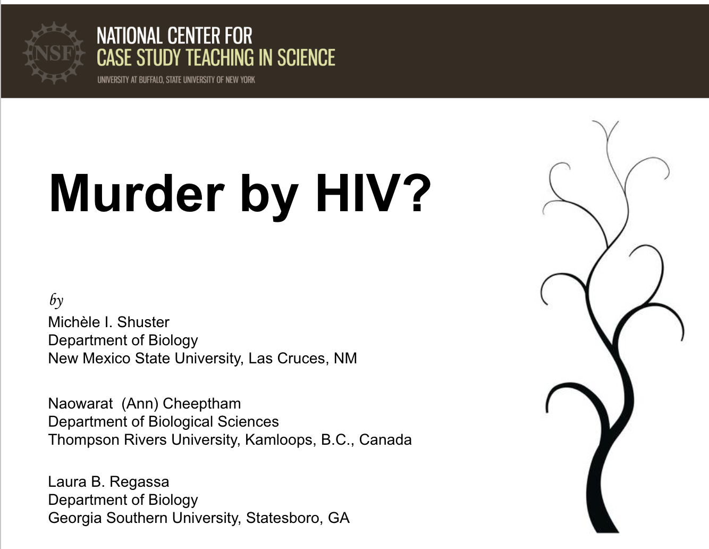
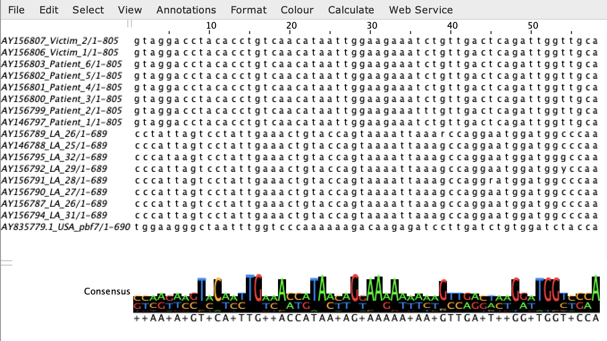
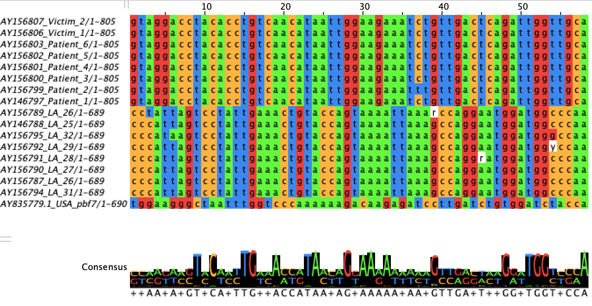
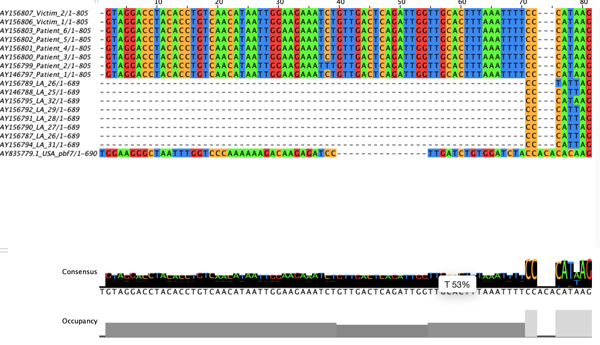
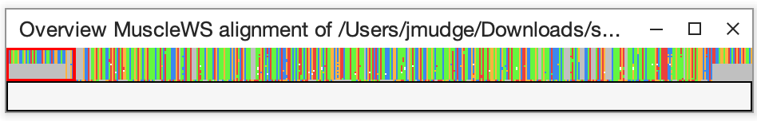

<!-- The text quality in a PNG is poor so using PDF. So far I still have pngs as the actual figures. I think that I have to do something different to have bookdown show pdfs. Actually, it just doesn't preview it. It puts it in a frame that you have to scroll through so for now I will just generate pngs on the sides to put in the bookdown doc.-->
<!-- Might want to put in how to color branches so you can squeeze more sequences in a smaller tree.-->

# Multiple Sequence Alignments

In this chapter, we will create multiple sequence alignments (MSAs), which allows us to compare and line up many sequences as a group. Later we will use these sequences to create a phylogenetic tree.


## Disease Corner

The chronic disease "acquired immunodeficiency syndrome" (AIDS) is caused by the "human immunodeficiency virus" (HIV), a diploid RNA virus. HIV-1 is the  The virus attacks white blood cells, which are part of the immune system, making the patient more susceptible to other diseases. HIV spreads through bodily fluids including blood, breast milk, semen, and vaginal fluids but not saliva. 

<!-- In 1987 Princess Di shook hands with an AIDS patient without gloves. The quote is from the same event: the opening of the UK's first purpose-built HIV/AIDS unit (London Middlesex Hospital). -->

:::hiv
"HIV does not make people dangerous to know, so you can shake their hands and give them a hug: Heaven knows they need it."

Princess Diana, 1987
:::

<!-- To date, globally -->

Estimates are that HIV has killed over 44 million people with over 40 million people currently living with HIV (~2/3 in Africa). HIV can integrate into the host genome where is can escape detection and lay dormant before potentially reactivating. There is no cure but antiretroviral therapy can help prevent and treat HIV infection. With proper medical care, patients with this chronic condition can lead long, healthy lives (World Health Organization (WHO) July 15, 2025 [https://www.who.int/news-room/fact-sheets/detail/hiv-aids]).


## Murder by HIV case study



To start, we'll use the same sequences from the "Murder by HIV" case study (https://www.ncgr.org/wiki/dna-case-studies/case-study-sequences/murderbyhiv/).

The sequences are from the pol gene of the HIV-1 genome, which creates a polyprotein that is later cut into four separate proteins: a protease, a reverse transcriptase, an RNase, and an integrase.

<!-- Ask the students what each one does -->

https://pmc.ncbi.nlm.nih.gov/articles/PMC4924471/

## Jalview

We are going to line up the sequences so that their corresponding nucleotides all match up. This may involve adding in gaps here and there where some sequences have insertions relative to other sequences.

We'll start with a java tool which will allow us to do an alignment and to visualize it.

Dowload the murderxhiv.fa file onto your computer.

Install Jalview (https://www.jalview.org/). Click on download and choose the windows or mac version and install it.

Open up Jalview.

Close all the windows except the blank window at the back.

Go to main menu at the very top. Choose File > Input Alignment > From File -
Then choose the murderxhiv.fa file.

{width=70%}

It is expecting an aligned fasta file and we are opening up a fasta file that hasn't been aligned yet. Let's take a look at it in its unaligned form, first.

Color the sequences by nucleotide by choosing:
Colour > Nucleotide

{width=70%}

Now let's align them. We'll use the MAFFT (Multiple Alignment using Fast Fourier Transform) aligner, which is a very fast multiple sequence aligner.

Choose:
Web Service > Alignment > Mafft with defaults


Go ahead and color by nucleotide again.

{width=70%}

Now things line up better (except the USA sequence).

<!-- Looks like the USA sequence is a different part of the genome or gene. -->

The dashes indicate gaps that were introduced to make the sequences line up. In other words, there is an insertion or deletion (indel) that occured in one of the lines. The consensus and occupancy tracks can tell you quickly whether everything has sequence in that region (occupancy) and whether they all have the same nucleotide (consensus).

Scroll along the sequences to see how they line up along their length.

Take a look at the overview window.
View > Overview Window

{width=100%}

Expand it by hovering over the bottom right-hand corner until the cursor changes, then click and drag to make it bigger.

This gives you a good overview of the full MSA. The red box in the overview window shows where you are in the original window.

If you click on the overview, it will take you to the corresponding position in the alignment window. Try it.

Close the overview window. Scroll through the genome. What nucleotide letters do you see besides A, C, G, and T? 

Look up what they mean here: https://genome.ucsc.edu/goldenPath/help/iupac.html

Most alignment programs can recognize IUPAC codes and align them appropriately.

Why might there be more than one nucleotide at a single genomic position?

<!-- Here it is likely due to heterozygosity given this is a diploid genome. There are not any 3 or 4 nucleotide codes. Other reasons include sequencing more than one isolate, or having random sequencing errors in low coverage sequence that get incorporated into the consensus, or systematic errors. -->

## Server

Now let's do a multiple sequence alignment on the server using "MAFFT". This will allow us to do much bigger datasets.

Log onto the server.

Get into a new screen called "msa-tree".

Create a directory called "msa-tree" in your home directory.

Go into the directory you just created.

Create a soft link to the sequences (/home/data/nise/murderxhiv.fa).

<details>
  <summary>Click for Answers</summary>
```{bash, eval=FALSE}
ssh -p 2406 <username>@inbre.ncgr.org

screen -S msa-tree

mkdir ~/msa-tree

cd ~/msa-tree

ln -s /home/data/nise/murderxhiv.fa .
```
</details>

Activate the environment.

```{bash, eval=FALSE}
conda activate msa-tree
```

Run the multiple sequence alignments.

```{bash, eval=FALSE}
mafft murderxhiv.fa  > mafft.murderxhiv.fa
```

Take a look at the file.

```{bash, eval=FALSE}
ls -l
```


:::work
Practice multiple sequence alignments with another set of HIV-1 sequences and the related simian immunodeficiency virus (SIV), which infects non-human primates. In this case all the SIV sequences were isolated from chimpanzees. These sequences are also from the pol gene.

Sequences are here: /home/data/nise/hiv1pol.fa

Create MAFFT MSAs both in Jalview and on the server and answer the following questions.

1. How many sequences are there?  
2. How many sequences are there from chimpanzees (they have "CPZ" in the sequence header)?  
3. Which IUPAC codes are present in the sequences besides A, C, G, T, and N? What nucleotides do they represent?
:::
